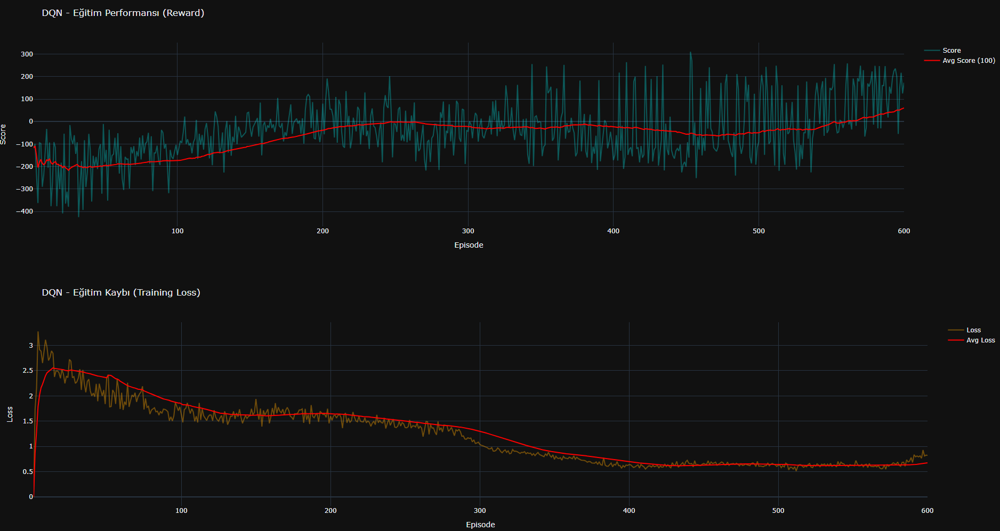
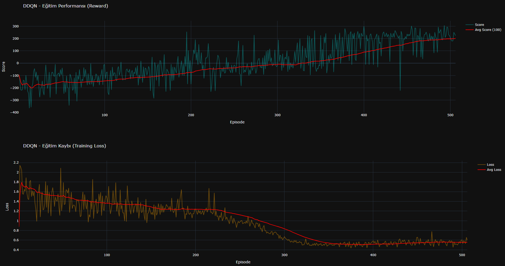
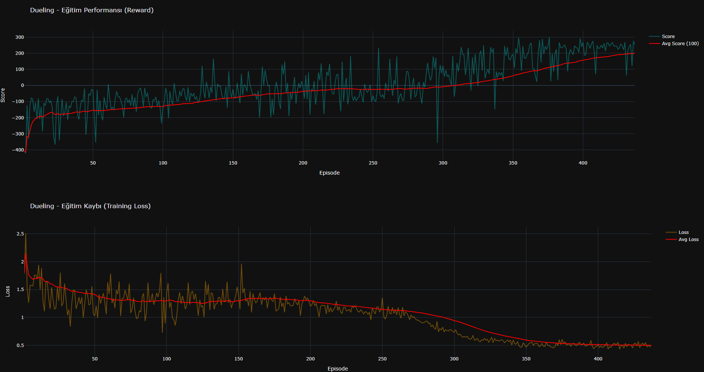
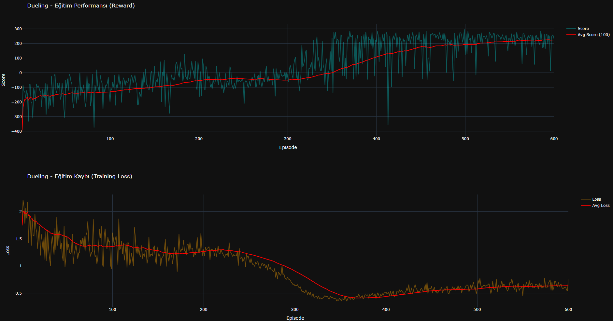

# **Deep Reinforcement Learning Analysis with LunarLander-v3**

This project provides a comprehensive experimental analysis of **value-based deep reinforcement learning algorithms** applied to the **LunarLander-v3** environment from Gymnasium.  
The primary goal is to compare different Deep Q-Learning variants under identical conditions and analyze their **learning stability, convergence behavior, and performance characteristics**.

The study focuses on the following algorithms:
- **Deep Q-Network (DQN)**
- **Double Deep Q-Network (DDQN)**
- **Dueling Deep Q-Network (Dueling DQN)**

All models are trained from scratch, evaluated using standardized metrics, and analyzed through reward curves, loss dynamics, and qualitative gameplay rollouts.

---

## **Project Structure**

```text
├── LunarLander_Models/
│   ├── dqn_model.py
│   ├── ddqn_model.py
│   └── dueling_dqn_model.py
│
├── assets/
│   ├── training_base.png
│   ├── training_ddqn.png
│   ├── training_dueling.png
│   ├── training_dueling_final.png
│   ├── arcdqn_dueling.png
│   ├── arcv2.png
│   ├── dqn.mp4
│   ├── ddqn.mp4
│   └── DUELING INIŞ BEST.mp4
│
├── notebook/
│   └── experiments.ipynb
│
├── report/
│   └── project_report.pdf
│
└── main.py
```
---

## **Environment Description**

All experiments are performed on **LunarLander-v3** from the **Gymnasium** library.  
This environment is a standard benchmark for evaluating value-based deep reinforcement learning due to its mixed characteristics: continuous state, discrete control, and reward shaping.

### **Key Properties**

- **Action space (Discrete, 4 actions)**  
  The agent chooses among four discrete actions: do nothing, fire left engine, fire main engine, fire right engine.  
  Although control is discrete, the environment is still challenging because actions must be timed precisely to stabilize descent and landing.

- **State space (Continuous, 8 dimensions)**  
  The observation vector includes lander position, velocity, angle, angular velocity, and leg contact indicators.  
  This makes the problem non-trivial for tabular methods and motivates function approximation with neural networks.

- **Sparse + delayed reward signals**  
  Rewards are shaped but still delayed in the sense that early decisions strongly affect later outcomes.  
  The agent must learn long-horizon behavior (approach, stabilize, descend, land) rather than short reactive moves.

- **Sensitivity to unstable policies**  
  Small mistakes can rapidly amplify (e.g., overcorrecting angle or velocity), leading to crashes or drifting out of bounds.  
  This property makes LunarLander a strong testbed for comparing learning stability across DQN variants.

### **Why LunarLander is a Good Benchmark Here**

LunarLander exposes the typical weaknesses of value-based methods:
- **Overestimation bias** can destabilize DQN training,
- credit assignment is non-trivial due to delayed consequences,
- and the environment requires both **smooth control behavior** and **long-term planning**.

For this reason, LunarLander-v3 is well-suited for evaluating whether architectural improvements (DDQN and Dueling DQN) provide more stable learning and better final policies.

## **Models and Training Setup**

This project compares three value-based deep reinforcement learning algorithms under **identical training conditions** in order to ensure a fair and interpretable comparison.

### **Compared Algorithms**

- **Deep Q-Network (DQN)**  
  The baseline algorithm that approximates the action–value function using a single neural network and experience replay.

- **Double Deep Q-Network (DDQN)**  
  An improved variant of DQN that reduces Q-value overestimation by decoupling action selection and action evaluation.

- **Dueling Deep Q-Network (Dueling DQN)**  
  An architecture that separately estimates the **state value** and **action advantage**, enabling more efficient learning in states where action choice has little effect.

All three models share the same backbone network design and training pipeline, allowing architectural differences to be isolated as the main factor influencing performance.

---

## **Training Configuration**

All agents are trained using the same hyperparameters to ensure comparability.

- **Optimizer:** Adam  
- **Loss function:** Mean Squared Error (MSE)  
- **Discount factor (γ):** 0.99  
- **Replay buffer:** Experience Replay  
- **Exploration strategy:** ε-greedy with decay  
- **Training episodes:** Fixed across all models  
- **Target network update:** Periodic synchronization  

The only differences between experiments arise from **algorithmic design choices**, not from tuning advantages.

---

## **Training Dynamics Visualization**

To analyze learning behavior beyond final scores, training dynamics are visualized using reward and loss curves.

The following figures illustrate how each algorithm learns over time:

- **Training reward curves** show convergence speed and stability  
- **Loss curves** reflect optimization behavior and variance during learning  

**Figure 1 — Training Reward Curve (DQN)**  



---

**Figure 2 — Training Reward Curve (Double DQN)**  



---

**Figure 3 — Training Reward Curve (Dueling DQN)**  



---

**Figure 4 — Final Training Performance (Best Dueling DQN Run)**  



---

These visualizations make it possible to directly compare convergence speed, stability, and variance across models.

---

## **Qualitative Policy Evaluation**

In addition to numerical metrics, trained agents are evaluated qualitatively through environment rollouts.

Gameplay videos provide insight into:
- landing smoothness,
- stability during descent,
- and recovery from unstable states.

---

**Figure 5 — DQN Agent Gameplay**  


---

**Figure 6 — Double DQN Agent Gameplay**  


---

**Figure 7 — Best Dueling DQN Agent Gameplay**  


---

These rollouts help validate whether higher rewards correspond to genuinely better control policies rather than reward exploitation.

